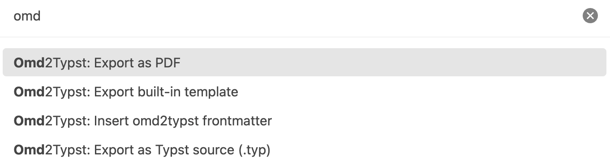
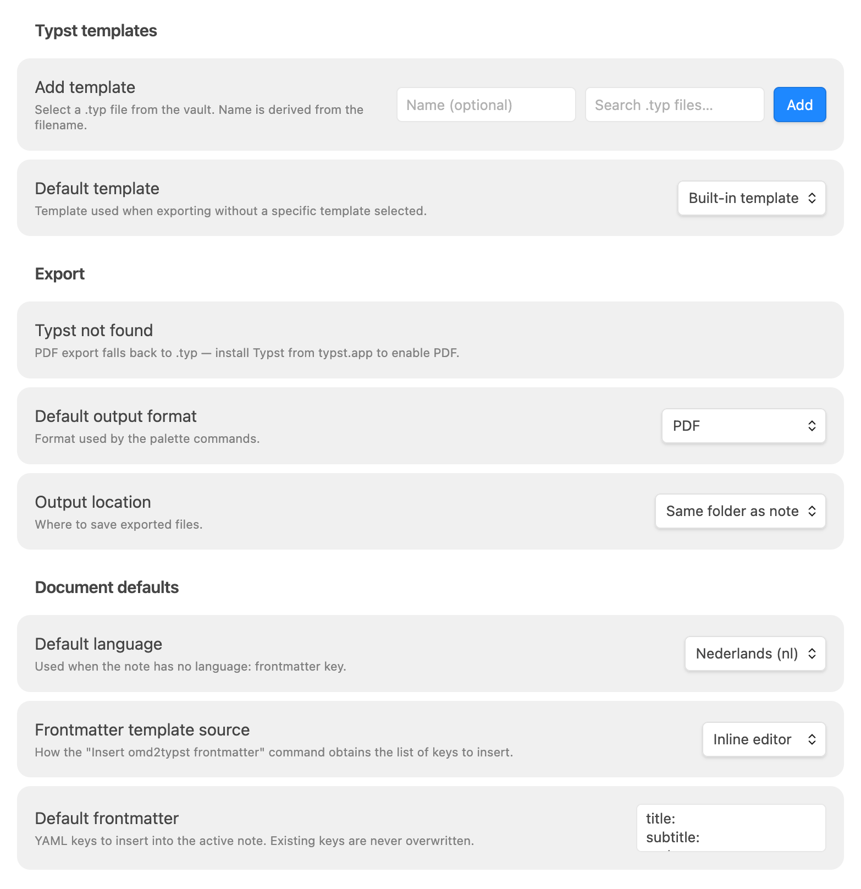
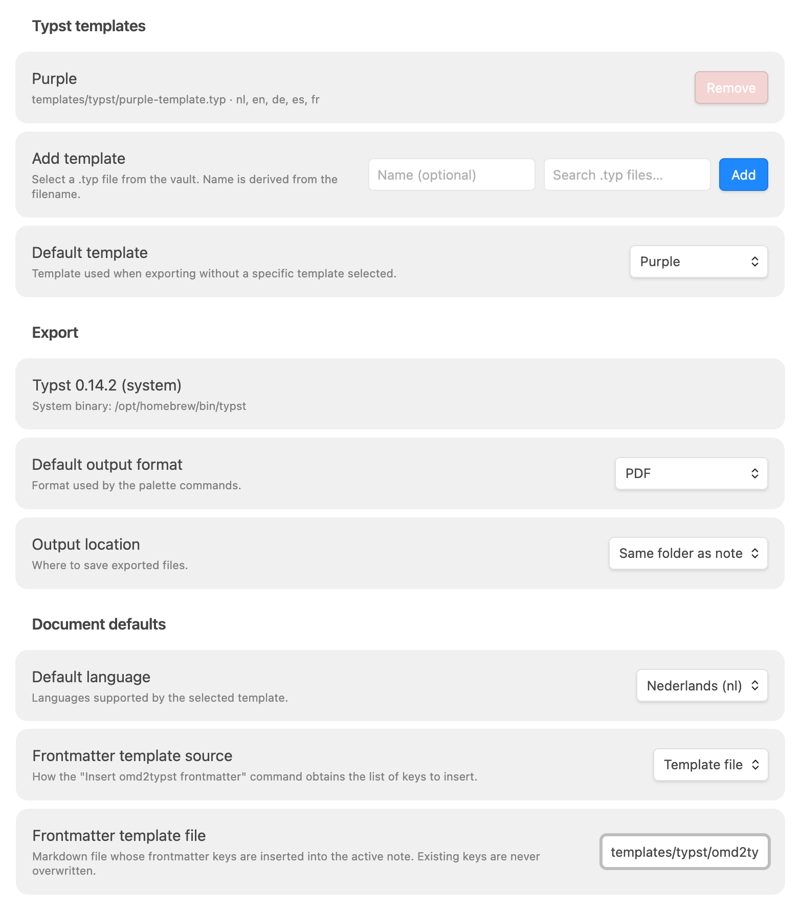
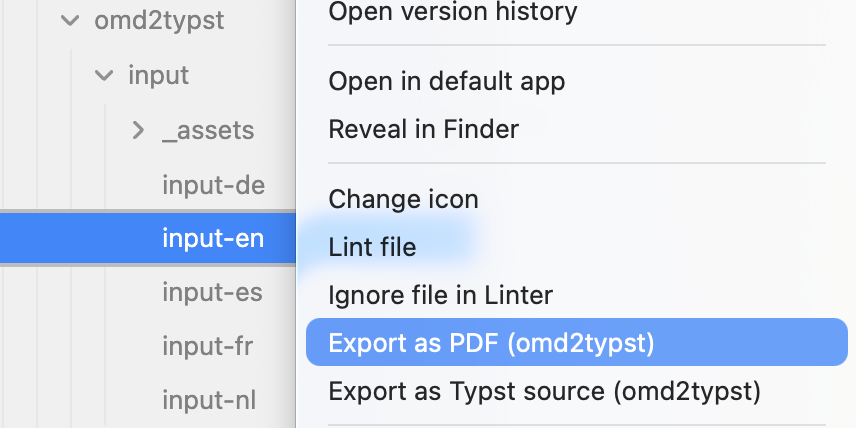
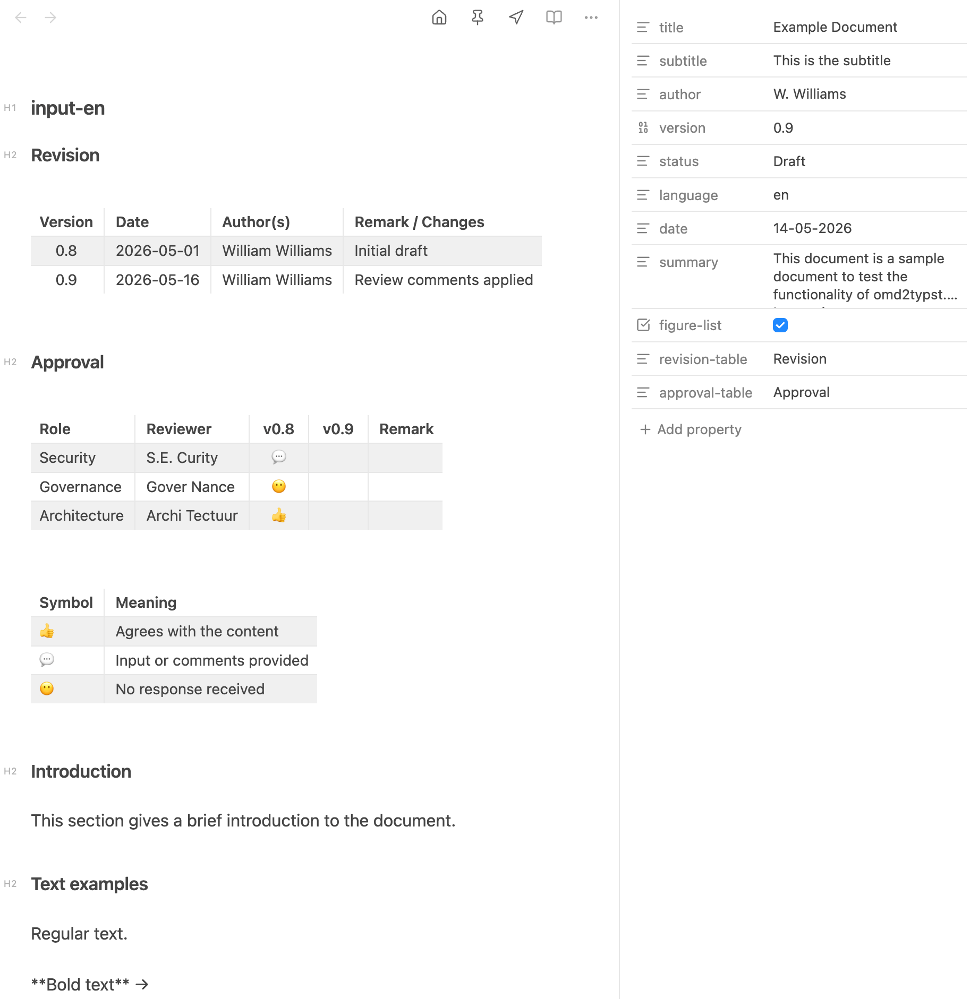
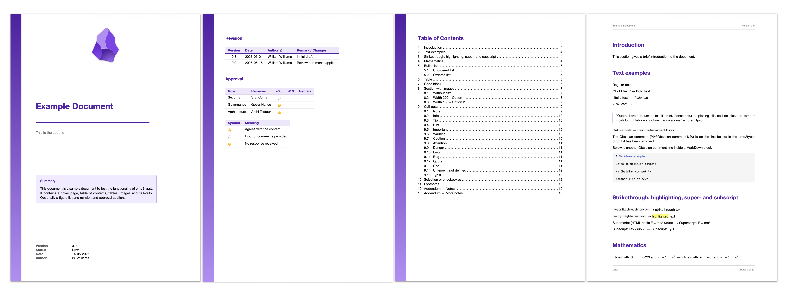

# Omd2Typst

Export your Obsidian notes to professionally typeset PDFs — with a structured cover page, auto-numbered table of contents, callout blocks, tables, images, and support for five languages — using [Typst](https://typst.app), a modern document compiler.

> **Desktop only** — macOS, Windows, Linux. Not available on mobile.

---

## Screenshots

### Command palette

Command palette showing the four Omd2Typst commands:



### Settings

**Default settings**

Default settings, without [Typst](https://typst.app) installed. No export to PDF, only export to .typ.



**Configured settings**

Configured settings with, sample template, installed Typst version and template for the frontmatter.



## Context menu

The right-click context menu with the two options "Export as PDF" and "Export as Typst".



## Frontmatter

Frontmatter from the sample input file. with the
**Sample input file with frontmatter**


## PDF output

The sample PDF output, shows the Typst generated output from the input file. Download the [example input files and templates](https://github.com/tIsGoud/Obsidian-Omd2Typst/releases/latest/download/omd2typst-examples.zip) to get started.

This partial PDF output shows the added front page, the added revision and approval page and the table-of-contents. The optional figure-list is not shown here.



---

## Requirements

- **Obsidian** 1.4.0 or later
- **Typst** — required for PDF export
  - Install: `brew install typst` (macOS) · `winget install --id Typst.Typst` (Windows) · or download from [typst.app](https://typst.app)
  - The plugin searches common locations automatically; no path configuration needed in most cases
  - Without Typst, `.typ` source export still works — PDF export shows an install notice

---

## Installation

### Via the Community Plugin browser *(recommended)*

1. In Obsidian: **Settings → Community plugins → Browse**
2. Search for **Omd2Typst**
3. Click **Install**, then **Enable**

### Manual install

1. Download `main.js` and `manifest.json` from the [latest release](https://github.com/tIsGoud/Obsidian-Omd2Typst/releases/latest)
2. Create a folder `.obsidian/plugins/obsidian-omd2typst/` inside your vault
3. Copy both files into that folder
4. In Obsidian: **Settings → Community plugins → enable Omd2Typst**

---

## Features

- Export the active note as **PDF** or **Typst source (`.typ`)** from the command palette or the right-click file menu
- **Cover page** — populated from YAML frontmatter (`title`, `subtitle`, `author`, `date`, `version`, `status`, `summary`)
- **Table of contents** with numbered headings
- **Revision and approval tables** — extracted from named sections and placed before the TOC
- **13 callout types** with Lucide SVG icons (`note`, `tip`, `warning`, `danger`, `bug`, `quote`, …)
- **10 checkbox variants** (`- [ ]` to `- [*]`)
- **Custom templates** — register any `.typ` file in your vault; `.typ` files are visible in the vault navigator and file pickers without enabling *Show all file types*; supported languages are detected automatically
- **Five languages** — `nl` · `en` · `de` · `es` · `fr`; the default language dropdown updates automatically when you switch templates
- **Frontmatter insertion** — insert a configurable YAML frontmatter block; existing keys are never overwritten
- **Output location** — same folder as note, fixed folder (with vault autocomplete), or ask every time

---

## Commands

| Command | Palette | Right-click menu |
|---|---|---|
| Export as PDF | ✓ | ✓ |
| Export as Typst source (.typ) | ✓ | ✓ |
| Insert omd2typst frontmatter | ✓ | — |
| Export built-in template | ✓ | — |

---

## Settings

### Typst templates

| Setting | Description |
|---|---|
| **Template list** | Each registered template shows its name, vault-relative path, and the languages detected from its `_lang_strings` dictionary. |
| **Add template** | Select a `.typ` file from the vault using the autocomplete picker. The name is auto-filled from the filename and can be edited before adding. |
| **Default template** | Used for right-click exports and as the pre-selected option in palette exports. Changing this also updates the available *Default language* options. |

### Export

The top of the Export section shows the detected Typst version and path, or *"Typst not found"* with an install hint. This is a status indicator — not a configurable option.

| Setting | Description |
|---|---|
| **Default output format** | `PDF` or `Typst source (.typ)`. |
| **Output location** | *Same folder as note* / *Fixed folder* (vault folder autocomplete) / *Ask every time*. |

### Document defaults

| Setting | Description |
|---|---|
| **Default language** | Applied when the note has no `language:` frontmatter key. Options are limited to the languages supported by the selected default template. |
| **Frontmatter template source** | Controls how the *Insert omd2typst frontmatter* command works — see below. |

#### Frontmatter template source modes

| Mode | Behaviour |
|---|---|
| **Inline editor** | Edit `key: value` lines directly in settings. Running the command inserts any missing keys (with their default values) into the active note's frontmatter. Existing keys are never overwritten. |
| **Template file** | Select a `.md` file in the vault. The command reads that file's frontmatter and inserts missing keys (with their values) into the active note. |
| **User defined** | The built-in insert command is disabled. Use Templater, the Templates core plugin, or any other frontmatter tool of your choice. |

---

## Supported Markdown features

Full coverage of standard Markdown plus the most-used Obsidian extensions:

| Feature | Notes |
|---|---|
| Headings `# H1` … `###### H6` | Level offset applied automatically when document has a title |
| Bold, italic, strikethrough, highlight | `**`, `*`, `~~`, `==` |
| Inline and display math | Typst math syntax — `$…$` and `$$…$$` |
| Code blocks with language tag | Language label preserved |
| Tables | Left / center / right alignment |
| Images — standard `` and wikilink `![[path\|width]]` | Width in points |
| Callouts `> [!type] Title` | 13 built-in types with Lucide SVG icons |
| Block quotes `> text` | Left accent bar |
| Checkbox lists | 10 variants: `[ ]` `[x]` `[/]` `[-]` `[>]` `[!]` `[?]` `[i]` `[I]` `[*]` |
| Footnotes `[^1]` | Rendered at page bottom |
| Superscript `<sup>` / subscript `<sub>` | HTML inline tags |
| Obsidian wikilink images `![[…]]` | Converted automatically |
| Thematic breaks `---` | Full-width rule |
| Mermaid diagrams | Rendered via Obsidian's Mermaid; embedded as SVG. **Emoji codepoints in labels are stripped** — resvg (Typst's SVG renderer) can't render color-emoji glyphs cleanly (they either show as tofu or overflow the node boundary), so the plugin removes them and keeps the surrounding text. Example: `Foo 📊 Bar` → `Foo Bar`. |
| Obsidian Bases embeds `![[file.base]]` | Rendered via Obsidian's embed registry as a Markdown table |

For the complete feature reference including YAML frontmatter keys, callout icon colours, and checkbox meanings, see the [omd2typst README](https://github.com/tIsGoud/Omd2Typst#readme).

---

## Template authoring

Templates are standard Typst files that export a `template` function (document wrapper) and a `callout` function.

**Declare supported languages** by defining a `_lang_strings` dictionary:

```typst
#let _lang_strings = (
  "nl": ( toc: "Inhoudsopgave", ... ),
  "en": ( toc: "Table of Contents", ... ),
)
```

The plugin detects language support automatically — no annotation needed. Language codes appear as badges in the template list and limit the *Default language* dropdown.

To start from the built-in template, run **Export built-in template** — it writes `omd2typst-template.typ` to the vault root.

---

## Privacy

The plugin makes **no network requests** and collects **no data**. All processing is local:

- Markdown-to-Typst conversion runs inside a WASM module bundled inside `main.js`
- PDF compilation runs the locally installed `typst` binary via `child_process`
- No analytics, no telemetry, no external services

---

## Contributing

<details>
<summary>Project structure and build instructions</summary>

### Project structure

```
src/
  main.ts           — plugin lifecycle, commands, context menus
  settings.ts       — settings types, defaults, and settings tab UI
  exporter.ts       — export pipeline: read note → WASM → write output / compile PDF
  frontmatter.ts    — frontmatter parse, merge, and insert logic
  template.ts       — template language detection and resolution
  output.ts         — output path resolution for all three output modes
  typst-cli.ts      — findTypstBinary, detectSystemTypst, compileToPdfViaCli
  wasm/
    omd2typst.ts    — lazy-init wrapper around omd2typst WASM
    omd2typst-pkg/  — generated by wasm-pack (gitignored; WASM bundled into main.js at build)
libs/
  omd2typst/        — git submodule: omd2typst Rust repo (pinned commit)
scripts/
  build-wasm.sh     — runs wasm-pack inside the submodule
```

### Build

```bash
git submodule update --init       # pull omd2typst Rust source
./scripts/build-wasm.sh           # wasm-pack build → src/wasm/omd2typst-pkg/
npm install                        # dev dependencies
npm run build                      # esbuild → main.js (omd2typst WASM bundled in)
npm test                           # Jest unit tests
```

### Install into a vault (development)

```bash
VAULT=~/path/to/your/vault
mkdir -p "$VAULT/.obsidian/plugins/obsidian-omd2typst"
cp main.js manifest.json "$VAULT/.obsidian/plugins/obsidian-omd2typst/"
```

Then enable the plugin in Obsidian → Settings → Community Plugins.

</details>
